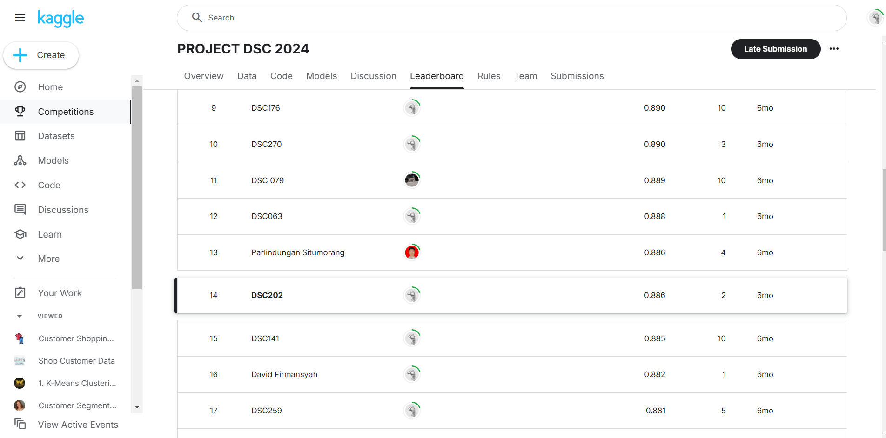

# Apple Quality Prediction using Machine Learning

## PROJECT Data Science Course ITS 2024


## Overview
PROJECT DSC 2024 adalah kompetisi Data Science yang diselenggarakan dalam rangka Data Science Course 2024 oleh HIMASTA-ITS. Kompetisi ini dilakukan di Kaggle dan berfokus pada pengembangan model machine learning untuk mengklasifikasikan kualitas apel berdasarkan berbagai fitur.

## Timeline
- **Start:** 26 Juli 2024  
- **Close:** 12 Agustus 2024  

## Description
Industri pertanian, khususnya perkebunan apel, menghadapi berbagai tantangan dalam memastikan bahwa setiap apel yang dipanen memiliki kualitas sesuai standar. Faktor seperti penyakit, hama, kondisi cuaca, dan teknik pemeliharaan dapat memengaruhi kualitas apel. Proses pengecekan apel secara manual seringkali memakan waktu lama serta rentan terhadap kesalahan manusia. Oleh karena itu, diperlukan model yang dapat membantu proses pengecekan apel secara otomatis dan akurat.

## Project Implementation
### 1. Data Preprocessing
- Menghapus data yang tidak relevan atau mengandung outlier.
- Menangani data yang hilang dengan metode imputasi.
- Normalisasi dan standarisasi data agar dapat digunakan secara optimal oleh model.

### 2. Model Development
Beberapa model machine learning yang diuji dalam proyek ini:
- **K-Nearest Neighbors (KNN)**
- **Support Vector Machine (SVM)**
- **Random Forest**
- **Naive Bayes**
- **Extra Trees Classifier**

Model dengan akurasi tertinggi digunakan untuk final submission.

### 3. Evaluation
- **Goal:** Memprediksi kualitas setiap apel pada test set.
- **Target Variabel:** `Quality`
- **Metric:** Accuracy Score

### 4. Results & Analysis
- Model terbaik dalam proyek ini adalah **Random Forest**, dengan akurasi mencapai **87.62%**.
- Feature importance menunjukkan bahwa **Sweetness** dan **Ripeness** adalah faktor yang paling berpengaruh terhadap kualitas apel.

## Dataset Description
Dataset terdiri dari beberapa file CSV:

### Files:
- `train.csv`: Data untuk melatih model.
- `test.csv`: Data untuk menguji model.
- `sample_submission.csv`: Contoh format file untuk submisi.

### Variable Description:
- `A_id` - ID unik untuk setiap apel.
- `Size` - Dimensi apel.
- `Weight` - Massa apel.
- `Sweetness` - Tingkat kemanisan apel.
- `Crunchiness` - Tekstur kerenyahan apel.
- `Juiciness` - Kandungan air dalam apel.
- `Ripeness` - Tingkat kematangan apel.
- `Acidity` - Tingkat keasaman apel.
- `Quality` - Kualitas apel (label yang diprediksi).

## Submission Format
File submisi memiliki header dan mengikuti format berikut:
```
A_id,Quality
2800,good
2801,good
2802,bad
...
```
## Ranking in Competition
Ranking #14


## Citation
Rendi Andria Gita Putra. PROJECT DSC 2024. [Kaggle Competition Link](https://kaggle.com/competitions/dsc-2024-temporary), 2024. Kaggle.
